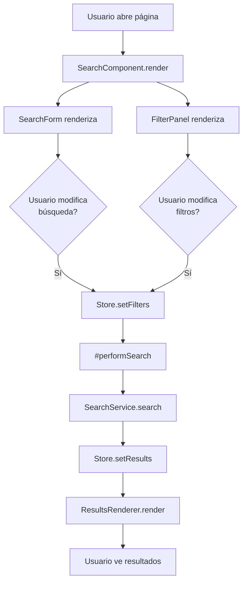
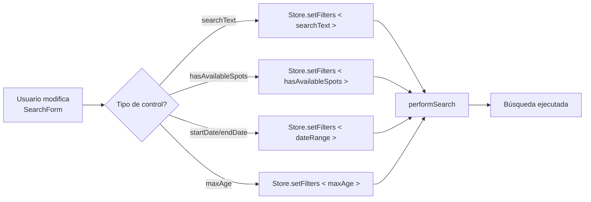
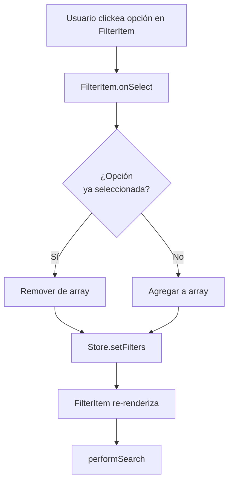
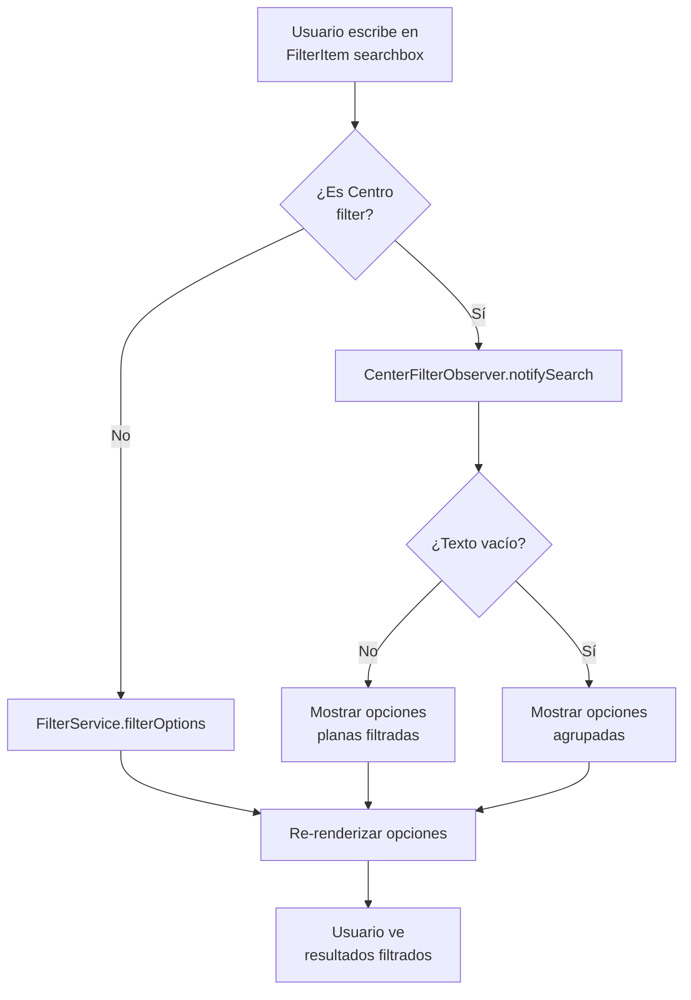
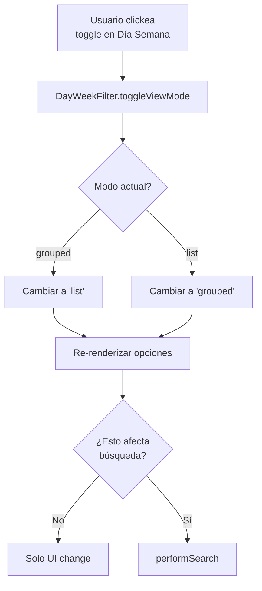
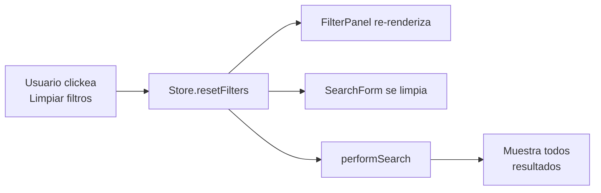
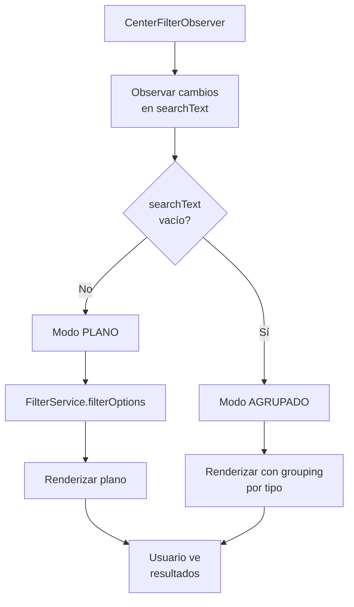
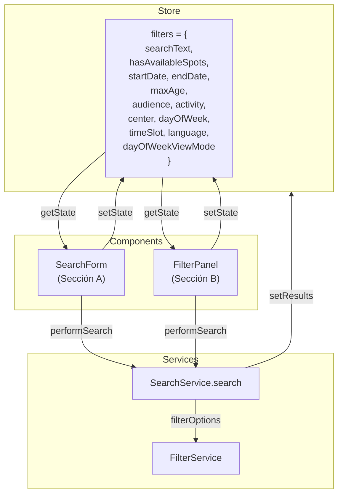
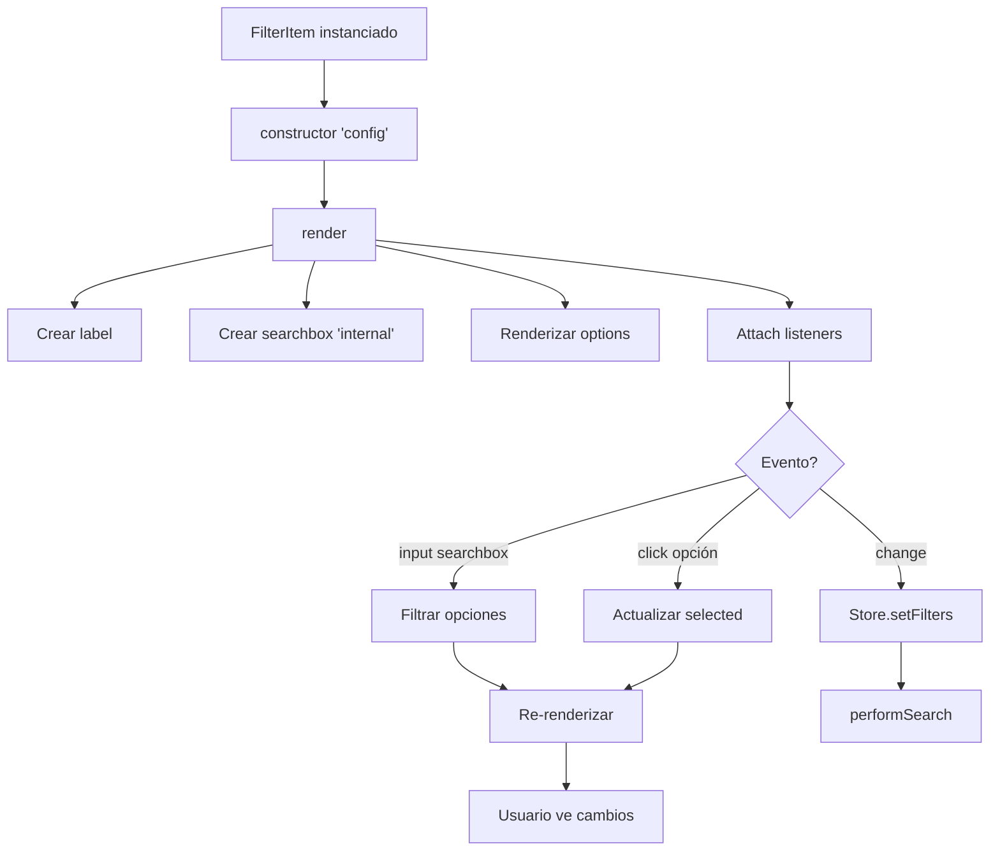

# Flujos de Interacción - Formulario y Filtros

## 1. Flujo General de Búsqueda



## 2. Flujo: Cambio en SearchForm



## 3. Flujo: Seleccionar Opción en Filtro



## 4. Flujo: Búsqueda Interna en Filtro



## 5. Flujo: A/B Testing Día Semana



## 6. Flujo: Limpiar Filtros



## 7. Observador Centro Filter



## 8. Relación Store + FilterPanel + SearchForm



## 9. Precedencia de Filtros (Operadores)

```
Lógica de aplicación de filtros:

AND entre categorías:
  audience[] AND activity[] AND center[] AND dayOfWeek[] AND timeSlot[] AND language[]

OR dentro de categorías:
  (audience[0] OR audience[1] OR ...) AND (activity[0] OR activity[1] OR ...)

BÚSQUEDA LIBRE:
  (searchText en título OR descripción) AND todos_los_filtros_anteriores

FECHA:
  startDate <= activity.startDate AND endDate >= activity.endDate

EDAD:
  maxAge <= activity.age.max
```

## 10. Ciclo de Vida de un FilterItem


